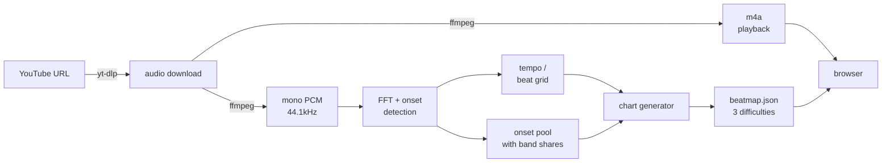

# Tap-Tap

A browser rhythm game that **builds its own charts from any song**. Paste a
YouTube link; a few seconds later you can play that track on 3, 4, or 5 lanes,
at three difficulties, with the notes falling in time with the music.

There is no note-charting by hand and no pack of pre-made songs. The whole point
of the project is the pipeline that turns raw audio into a playable, *musical*
chart automatically — the digital-signal-processing and the chart-generation
heuristics that decide where every note goes.

> **Local-only, by design.** It downloads audio with `yt-dlp` purely to analyse
> it, which is a fine thing to do on your own machine and a copyright/ToS
> problem the moment it is public. It is not built to be deployed, and there is a
> read-only mode for the rare case of letting a friend play over a private
> network. See [Legal & scope](#legal--scope).

---

## The idea

Rhythm games live or die on their charts — the arrangement of notes you tap.
Good charts are handcrafted and take hours per song. Tap-Tap asks a different
question: **how good a chart can you generate from nothing but the audio?**

That reframes the entire project around one hard problem — *listening to a track
and deciding what a human would tap to it* — and a lot of smaller ones fall out
of it:

- The clock has to be **sample-accurate**, or notes drift out of sync with what
  you hear. (Solved by self-hosting the audio, not embedding YouTube.)
- Input latency on a phone over Bluetooth can be **200ms+**, wider than the
  entire "good" timing window. (Solved by a calibration screen and a
  latency-aware judge.)
- The generated chart has to *feel* like the song, not like notes sprinkled at
  random. (Solved by the frequency-band + onset-strength heuristics below.)

It is written end-to-end in TypeScript — including the DSP — with no Python, no
native audio libraries, and no machine-learning model. Everything is explicit
and tunable.

---

## What it looks like

- **Menu** — search, sort, favourite tracks; pick a difficulty.
- **Play** — a neon 3D highway (three.js) with notes on a curved, receding
  track; an 80s-sunset backdrop; hit/miss juice and haptics.
- **Admin** — paste a YouTube link, watch it ingest, rename/retheme/regenerate
  songs, and design colour themes with a live preview.
- **Editor** — a read-only timeline view of a chart against the waveform.
- **PWA** — installable; songs you have played once stay playable offline.

---

## Architecture

Three TypeScript workspaces, one wire contract between them.

```
shared/   The wire contract. Beatmap, chart, note, difficulty params, themes.
          Both other workspaces import it, so the server physically cannot
          emit a shape the game rejects. Single source of truth.

server/   Node + Express on :8787.
          analysis/  the DSP — FFT, onset detection, tempo, sustains, waveform
          charts/    turns detected onsets into a playable chart per difficulty
          ingest/    yt-dlp -> ffmpeg -> analyse -> generate -> save
          Stores each song as a folder of files. No database.

web/      Vite + React + three.js.
          game/      PURE TypeScript — clock, judge, scoring, engine. No DOM,
                     no three.js, no React. Fully unit-tested.
          render/    the three.js highway. Reads game state; never owns it.
          screens/   menu, play, results, calibration, admin, themes, editor
          sw.ts      service worker for offline play
```

### Three decisions that shape everything

**1. YouTube is an ingestion tool, not a runtime dependency.** The server
downloads audio to analyse it, then *serves that audio itself* rather than
embedding the YouTube player. This deletes the single hardest problem in a
rhythm game — timing. The embedded player only exposes `getCurrentTime()` at
~250ms granularity and no access to the raw samples; a self-hosted file gives
`AudioContext.currentTime`, which is **sample-accurate**, plus the full FFT of
every frame. The frontend contains no YouTube code at all.

**2. The audio clock is the only clock.** `AudioContext.currentTime` drives all
game timing. `requestAnimationFrame` drives *rendering only*. Nothing that the
player can hear or feel is ever timed with `setTimeout`, `setInterval`, or
accumulated frame deltas — those drift, and drift in a rhythm game is the whole
ballgame.

**3. Game logic contains zero rendering.** `web/src/game/` is pure TypeScript
that takes a chart and a time and answers questions about notes and score. It
imports nothing visual and is tested with no browser. The three.js highway is a
*view* that reads this state each frame. This is why the rules can be trusted:
they are tested in isolation from the thing that draws them.

### The pipeline



Analysis is **cached to disk**, so regenerating a chart with new parameters
never re-downloads or re-analyses — it is instant. Playback decodes the *same*
m4a the analysis measured, so notes are timed against the audio you actually
hear (AAC adds ~20–50ms of encoder priming delay; analysing the source and
playing the transcode would put every note slightly early).

---

## The chart-generation algorithm

This is the heart of the project. Turning a waveform into a chart is four steps:
find the hits, find the tempo, decide which hits become notes, and decide which
lane each note goes to. The interesting decisions are in steps 1 and 4.

### 1. Onset detection — where are the hits?

The audio is cut into overlapping 2048-sample frames (512-sample hop, ~12ms).
Each frame is Hann-windowed and run through a hand-written FFT. The algorithm
then computes **spectral flux**: how much the spectrum *grew* since the last
frame, summed only over bins that got louder. A sharp increase in energy is what
a drum hit, a plucked string, or a struck key looks like — an onset.

A peak in the flux is an onset when it clears an **adaptive threshold** (a
rolling median over ~20 frames, times 1.25), so a loud chorus and a quiet verse
are judged on their own local terms rather than one global cutoff. Onsets closer
than 45ms are merged.

One subtlety worth calling out, because it caused a real bug: an onset is
reported at the **centre** of its analysis window, not the start. A transient
can enter a 2048-sample window up to ~46ms before the frame that detects it, so
timing everything to the frame start put every note ~20–25ms early. Onset times
and the beat grid now share a `frameSize/2` origin.

### 2. Tempo — how fast, and where are the beats?

The onset-detection function (the flux over time) is **autocorrelated** to find
the beat period: the lag at which the signal most resembles a shifted copy of
itself is the beat length. Lags are restricted to 60–200 BPM, with a mild
preference for 90–180 BPM to resist the classic half-time/double-time error.
Then the phase is swept to align a grid to the actual beats.

The result carries a **confidence** score (how sharply the autocorrelation
peaks). Below ~0.5, the detected tempo is probably wrong, and the admin UI flags
the song so you can re-check it.

The beat grid is treated as a *guess*, not truth — see step 3.

### 3. Note selection — which onsets become notes?

Each difficulty is a **filter over the same shared onset pool** (which is why
regeneration is instant — the expensive analysis is already done).

| Difficulty | Lanes | Keys | Quantise | Min gap | Target notes/sec |
|---|---|---|---|---|---|
| Easy | 3 | `S D F` | 1/4 note | 450ms | ~1.2 |
| Medium | 4 | `A S D F` | 1/8 | 300ms | ~2.0 |
| Hard | 5 | `A S D F G` | 1/16 | 190ms | ~3.6 |

Keys are one left hand, scaling outward from the home row.

Two heuristics here are load-bearing:

**Density is budgeted per section, not globally.** Ranking every onset by
loudness and taking the top *N* fails badly on any track with real dynamics: a
soft intro's onsets are all weak in absolute terms, so they lose to the loud
sections and the intro gets *no notes at all*. Instead the song is split into
short windows, each given a floor (nothing is ever empty) plus a share of the
remaining budget proportional to how much onset energy it actually contains.
Loud passages still get more notes; quiet ones still get some.

**Snapping to the beat grid is conservative.** The grid is extrapolated from one
constant tempo, so it drifts on anything not machine-perfect — half a BPM of
error is over a full beat across three minutes. Snapping every onset onto it
would drag correctly-timed notes progressively out of sync. So a note is nudged
onto the grid *only when the grid already agrees with it*, within 30ms. The
onsets are ground truth; the grid only tidies jitter, and can never itself
introduce drift.

`minGapSec` matters more than the target density: the target is only an average,
while the gap is a hard ceiling on a sustained stream. A generous target against
a tight gap produces a wall of evenly-spaced notes instead of a rhythm — a real
failure mode that made an early "medium" unplayable.

### 4. Lane assignment — the decision that makes it feel musical

This is what separates a chart that feels like the song from one that feels like
random noise. **Onsets are assigned to lanes by frequency band**: kick/bass on
the left, snare and vocal body in the centre, hats and melody on the right — so
your hand physically mirrors the drum kit.

The hard part is *choosing the band*. Three approaches were tried; only the
third survives real music:

1. **Loudest band wins.** Fails completely. "Which band is loudest?" is a
   property of the *mix*, not the moment — a bright, hat-forward master answers
   "high" for every single onset. This produced a real chart with every note in
   one lane.

2. **Energy over a per-band baseline.** Better, but a band with no real signal
   divides noise by noise (an unbounded ratio), so a pure bass note could
   classify as "high" on floating-point error alone.

3. **Percentile rank within each band's own distribution.** ✅ For every onset,
   rank its low/mid/high energy against every *other* onset in the song, and
   take the band where it ranks highest — "which band is this hit most
   *exceptional* in?" This is scale-free: invariant to overall brightness, gain,
   and the fact that the treble band spans ~650 frequency bins against ~12 in
   the bass. Crucially, it is **structurally incapable of returning the same
   answer every time**, which makes the all-notes-in-one-lane failure impossible
   rather than merely unlikely.

Within a band's lane range, a note avoids repeating the previous lane where it
can — back-to-back same-lane notes are "jackhammers" that feel bad even when
they are rhythmically correct.

### How chart quality is measured, not guessed

You cannot tune this by ear alone. The diagnostic that matters: decode the
audio, compute per-second RMS loudness and per-second note count, and
**correlate them**. A chart that tracks the music has a strongly positive
correlation; near-zero or negative means the notes are fighting the song. This
caught two separate bugs that sounded plausible but measured terribly. The DSP
itself is likewise tested against *synthetic* audio with known ground truth —
click tracks at a known BPM, alternating kick/hat patterns — not by eyeballing a
real song.

---

## Timing & fairness: calibration

A note is judged by how close your tap is to its time. But "its time" is when
the audio is *scheduled*, and on a phone over Bluetooth you hear it 200ms+
later — wider than the entire "good" window. Uncalibrated, a perfectly-timed tap
registers as a miss.

So there is a **calibration screen**: a metronome plays, you tap along, and the
median offset becomes a per-device correction the judge subtracts from every
input. Getting this measurement right was surprisingly deep (a naïve
"nearest-click" match aliases and reports a 300ms-late tap as 200ms *early*), and
the renderer has to draw in the same shifted time as the judge or a visually
perfect tap is judged early. These are the kinds of problems the project is
actually made of.

---

## Running it

Requires Node 22+. `yt-dlp` and `ffmpeg` are vendored as npm dependencies, so
there is nothing else to install.

```bash
npm install
npm run dev        # server on :8787, web on :5173 with hot reload — use this
```

Open **http://localhost:5173**, go to **Admin**, paste a YouTube link, wait for
it to analyse, then play.

Other commands:

```bash
npm test                                      # all unit tests
npm run build                                 # production web build + service worker
npm run serve:public                          # build + serve everything on :8787
npm run ingest -w server -- "<youtube-url>"   # ingest one song from the CLI
```

**`npm run dev` vs `npm run serve:public`:** develop on `:5173` (Vite, with hot
reload). Use `serve:public` to serve the built app from a single port — that is
also the only mode where the service worker and offline play exist.

### Docker

A `Dockerfile` and `docker-compose.yml` run the production build with a
persistent volume for the song library:

```bash
docker compose up -d --build     # starts on :8787, restarts on reboot
```

Everything a song needs — audio, chart, cached analysis, waveform — lives in one
volume, so the library survives `docker compose down`.

---

## Testing philosophy

The pure logic is genuinely tested — judge, engine, scoring, chart generation,
router, coordinate math — around 250 tests. Two conventions are worth stating:

- **DSP is tested against synthetic audio with known ground truth**, never by
  listening to a real track. A click track at a known BPM tells you if tempo
  detection is right; a real song cannot.
- **Chart quality is a measurement** (the loudness↔density correlation above),
  not an opinion.

Anything the game can hear or feel — the audio clock, calibration, hit
windows — has a regression test, usually written because it broke once.

---

## Legal & scope

This is a personal, local-only project. It uses `yt-dlp` to download audio
**for analysis**, which is fine on a machine you own and a violation of
YouTube's Terms of Service the moment it is served publicly — and `/media`
serves complete copyrighted tracks to anyone who can reach it. Do not deploy it,
port-forward it, or put it behind a public tunnel.

For letting a friend play over a **private** network (e.g. Tailscale) there is a
read-only mode (`TAP_TAP_PUBLIC=1`) that rejects every write — ingest, rename,
delete — and hides the admin UI, so the exposure is limited to playing what is
already there. It is still your responsibility to keep it private.

---

## Tech

TypeScript everywhere (strict). React + Vite + three.js on the front end;
Node + Express on the back. Hand-written FFT and DSP, a hand-rolled typed router,
and no runtime dependency that could be reasonably avoided — the DSP, the router,
and the offline service worker are all built from scratch because each is small
enough to understand completely and owning them makes every parameter tunable.
