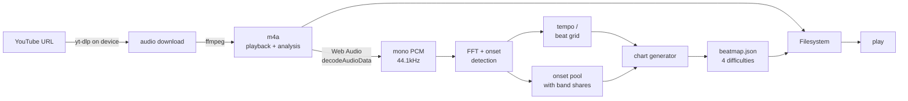

# Tap-Tap

A **serverless Android rhythm game that builds its own charts from any song.**
Paste a YouTube link on your phone; a few seconds later you can play that track on
four lanes, at four difficulties, with the notes falling in time with the music.
The download, the audio analysis, and the chart generation **all happen on the
device** — there is no server, and a song stays playable offline once it is in.

There is no note-charting by hand and no pack of pre-made songs. The whole point
of the project is the pipeline that turns raw audio into a playable, *musical*
chart automatically — the digital-signal-processing and the chart-generation
heuristics that decide where every note goes.

> **📥 Download:** grab the APK from the
> [**Releases**](https://github.com/avihaymenahem/tap-tap/releases) page and
> sideload it (Android only).

> **Personal use only, by design.** The app bundles `yt-dlp` to download audio
> purely so it can analyse it — fine on a phone you own, and a violation of
> YouTube's Terms of Service to distribute as a product. It cannot go on the Play
> Store. See [Legal & scope](#legal--scope).

---

## The idea

Rhythm games live or die on their charts — the arrangement of notes you tap.
Good charts are handcrafted and take hours per song. Tap-Tap asks a different
question: **how good a chart can you generate from nothing but the audio?**

That reframes the entire project around one hard problem — *listening to a track
and deciding what a human would tap to it* — and a lot of smaller ones fall out
of it:

- The clock has to be **sample-accurate**, or notes drift out of sync with what
  you hear. (Solved by decoding and playing the audio itself, not embedding the
  YouTube player.)
- Input latency on a phone over Bluetooth can be **200ms+**, wider than the
  entire "good" timing window. (Solved by a calibration screen, live
  auto-calibration, and a latency-aware judge.)
- The generated chart has to *feel* like the song, not like notes sprinkled at
  random. (Solved by the frequency-band + onset-strength heuristics below.)

The audio analysis and chart generation are **pure TypeScript** — a hand-written
FFT and DSP, no native audio library and no machine-learning model, so every
parameter is explicit and tunable. The one non-TypeScript piece is `yt-dlp`
(which carries its own Python and ffmpeg), used only to fetch and transcode the
audio; the analysis of that audio stays pure TS.

---

## What it looks like

- **Menu** — search, sort, favourite tracks; pick a difficulty; the detail panel
  recolours to the song's theme.
- **Play** — a neon 3D highway (three.js) with notes on a curved, receding track;
  an 80s-sunset backdrop; hit/miss juice, a combo meter, and haptics.
- **Add a song** — tap **+**, paste a YouTube link, and watch it download and
  analyse into a chart, right on the phone.
- **Manage** — rename, retheme, delete, and regenerate songs; design colour
  themes with a live 3D preview.
- **Results** — score, accuracy, a letter grade, and an early/late timing
  breakdown.

---

## Architecture

Four TypeScript workspaces and a Capacitor Android app. `shared/` is the wire
contract every other piece imports, so no two of them can disagree about what a
beatmap is.

```
shared/   The wire contract. Beatmap, chart, note, difficulty params, themes.
          Single source of truth; everything else imports it.

core/     PURE TypeScript DSP + chart generation. FFT, onset detection, tempo,
          sustains, waveform, lane assignment, difficulty filters. No Node, no
          DOM, no three.js — which is exactly why the same code runs on the dev
          server AND, in the shipped app, inside a WebView Web Worker.

web/      Vite + React + three.js — the game itself.
            game/    PURE TypeScript — clock, judge, scoring, engine. No DOM,
                     no three.js, no React. Fully unit-tested.
            render/  the three.js highway. Reads game state; never owns it.
            data/    the storage seam — Filesystem on device, HTTP in the browser
            ingest/  WebAudio decode + the analysis worker (on-device ingest)
            screens/ menu, play, results, calibration, admin, themes, editor

android/  The Capacitor project. Bundles the web build and a native yt-dlp
          plugin (youtubedl-android: yt-dlp + Python + ffmpeg) for on-device
          downloading. This is the shipped app.

server/   Node + Express — DEV ONLY. Powers fast browser UI development (the
          data seam talks HTTP to it) and desktop content authoring
          (npm run ingest). It is not part of the shipped app.
```

### Three decisions that shape everything

**1. YouTube is an ingestion tool, not a runtime dependency.** The app downloads
audio to analyse it, then *plays that file itself* rather than embedding the
YouTube player. This deletes the single hardest problem in a rhythm game —
timing. The embedded player only exposes `getCurrentTime()` at ~250ms
granularity and no access to the raw samples; a decoded file gives
`AudioContext.currentTime`, which is **sample-accurate**, plus the full FFT of
every frame. The frontend contains no YouTube player code at all.

**2. The audio clock is the only clock.** `AudioContext.currentTime` drives all
game timing. `requestAnimationFrame` drives *rendering only*. Nothing the player
can hear or feel is ever timed with `setTimeout`, `setInterval`, or accumulated
frame deltas — those drift, and drift in a rhythm game is the whole ballgame.

**3. Game logic contains zero rendering.** `web/src/game/` is pure TypeScript
that takes a chart and a time and answers questions about notes and score. It
imports nothing visual and is tested with no browser. The three.js highway is a
*view* that reads this state each frame. This is why the rules can be trusted:
they are tested in isolation from the thing that draws them.

### Serverless by design

The shipped app has no backend — everything runs on the phone:

- **Download & transcode** — a native Capacitor plugin wraps `yt-dlp` (bundled
  with its Python runtime and ffmpeg) and hands back an `m4a`.
- **Analysis & chart generation** — the *same* `@tap-tap/core` TypeScript, fed by
  the browser's `decodeAudioData`, running in a Web Worker off the main thread.
- **Storage** — each song is a folder (`beatmap.json`, `analysis.json`,
  `waveform.json`, `audio.m4a`, `thumb.jpg`) on the device's Filesystem.

A dev-only Node server exists so the UI can be built in a browser with hot
reload; the DSP is byte-for-byte identical whichever way it runs.

### The pipeline



Analysis is **cached to disk**, so regenerating a chart with new parameters never
re-downloads or re-decodes — it is instant. Playback decodes the *same* `m4a` the
analysis measured, so notes are timed against the audio you actually hear (AAC
adds ~20–50ms of encoder priming delay; analysing the source and playing the
transcode would put every note slightly early).

---

## The chart-generation algorithm

This is the heart of the project. Turning a waveform into a chart is four steps:
find the hits, find the tempo, decide which hits become notes, and decide which
lane each note goes to. The interesting decisions are in steps 1 and 4.

### 1. Onset detection — where are the hits?

The audio is cut into overlapping 2048-sample frames (512-sample hop, ~12ms).
Each frame is Hann-windowed and run through a hand-written FFT. The algorithm
then computes **spectral flux**: how much the spectrum *grew* since the last
frame, summed only over bins that got louder. A sharp increase in energy is what
a drum hit, a plucked string, or a struck key looks like — an onset.

A peak in the flux is an onset when it clears an **adaptive threshold** (a
rolling median over ~20 frames, times 1.25), so a loud chorus and a quiet verse
are judged on their own local terms rather than one global cutoff. Onsets closer
than 45ms are merged.

One subtlety worth calling out, because it caused a real bug: an onset is
reported at the **centre** of its analysis window, not the start. A transient
can enter a 2048-sample window up to ~46ms before the frame that detects it, so
timing everything to the frame start put every note ~20–25ms early. Onset times
and the beat grid now share a `frameSize/2` origin.

### 2. Tempo — how fast, and where are the beats?

The onset-detection function (the flux over time) is **autocorrelated** to find
the beat period: the lag at which the signal most resembles a shifted copy of
itself is the beat length. Lags are restricted to 60–200 BPM, with a mild
preference for 90–180 BPM to resist the classic half-time/double-time error.
Beats are then **tracked through the song** — not extrapolated from one constant
tempo — so a grid follows a human performance instead of sliding off it.

The result carries a **confidence** score (built from how steadily those tracked
beats collect energy and how well the strong onsets sit on them). Below ~0.5 the
detected tempo is probably wrong, the UI flags the song, and the grid is given no
say in chart generation at all — the onsets stand alone.

The beat grid is treated as a *guess*, not truth — see step 3.

### 3. Note selection — which onsets become notes?

Each difficulty is a **filter over the same shared onset pool** (which is why
regeneration is instant — the expensive analysis is already done).

| Difficulty | Lanes | Quantise | Min gap | Target notes/sec | Chords |
|---|---|---|---|---|---|
| Easy    | 4 | 1/4  | 450ms | ~1.2 | — |
| Medium  | 4 | 1/8  | 300ms | ~2.0 | 5% |
| Hard    | 4 | 1/16 | 190ms | ~3.6 | 15% |
| Extreme | 4 | 1/16 | 140ms | ~5.4 | 32% |

All four play on the **same four lanes** (`A S D F` on a keyboard; on a phone the
lane geometry is derived from the highway, so touch never needs keys). Only
density, spacing, scroll speed and chording change between tiers, so moving up
never means relearning your hand position.

Two heuristics here are load-bearing:

**Density is budgeted per section, not globally.** Ranking every onset by
loudness and taking the top *N* fails badly on any track with real dynamics: a
soft intro's onsets are all weak in absolute terms, so they lose to the loud
sections and the intro gets *no notes at all*. Instead the song is split into
short windows, each given a floor (nothing is ever empty) plus a share of the
remaining budget proportional to how much onset energy it actually contains.
Loud passages still get more notes; quiet ones still get some.

**Snapping to the beat grid is conservative.** Even a tracked grid is an estimate
and drifts less than it used to, but it is still not ground truth. So a note is
nudged onto the grid *only when the grid already agrees with it*, within 30ms,
and only when the tempo confidence clears 0.5. The onsets are ground truth; the
grid only tidies jitter, and can never itself introduce drift.

`minGapSec` matters more than the target density: the target is only an average,
while the gap is a hard ceiling on a sustained stream. A generous target against
a tight gap produces a wall of evenly-spaced notes instead of a rhythm — a real
failure mode that made an early "medium" unplayable.

### 4. Lane assignment — the decision that makes it feel musical

This is what separates a chart that feels like the song from one that feels like
random noise. **Onsets are assigned to lanes by frequency band**: kick/bass on
the left, snare and vocal body in the centre, hats and melody on the right — so
your hand physically mirrors the drum kit.

The hard part is *choosing the band*. Three approaches were tried; only the
third survives real music:

1. **Loudest band wins.** Fails completely. "Which band is loudest?" is a
   property of the *mix*, not the moment — a bright, hat-forward master answers
   "high" for every single onset. This produced a real chart with every note in
   one lane.

2. **Energy over a per-band baseline.** Better, but a band with no real signal
   divides noise by noise (an unbounded ratio), so a pure bass note could
   classify as "high" on floating-point error alone.

3. **Percentile rank within each band's own distribution.** ✅ For every onset,
   rank its low/mid/high energy against every *other* onset in the song, and
   take the band where it ranks highest — "which band is this hit most
   *exceptional* in?" This is scale-free: invariant to overall brightness, gain,
   and the fact that the treble band spans ~650 frequency bins against ~12 in
   the bass. Crucially, it is **structurally incapable of returning the same
   answer every time**, which makes the all-notes-in-one-lane failure impossible
   rather than merely unlikely.

Lane *widths* are then sized to the song: a band that carries most of the onsets
gets more of the board, so a hat-dominated track does not stack ~85% of its taps
on one lane. Within its lane range, a note avoids repeating the previous lane
where it can — back-to-back same-lane notes are "jackhammers" that feel bad even
when they are rhythmically correct.

### How chart quality is measured, not guessed

You cannot tune this by ear alone. The diagnostic that matters: decode the
audio, compute per-second RMS loudness and per-second note count, and
**correlate them**. A chart that tracks the music has a strongly positive
correlation; near-zero or negative means the notes are fighting the song. This
caught two separate bugs that sounded plausible but measured terribly. The DSP
itself is likewise tested against *synthetic* audio with known ground truth —
click tracks at a known BPM, alternating kick/hat patterns — not by eyeballing a
real song.

---

## Timing & fairness: calibration

A note is judged by how close your tap is to its time. But "its time" is when the
audio is *scheduled*, and on a phone over Bluetooth you hear it 200ms+ later —
wider than the entire "good" window. Uncalibrated, a perfectly-timed tap
registers as a miss.

So the offset is corrected per device: a **calibration screen** (tap along to a
metronome, the median offset becomes the correction), plus **live
auto-calibration** that learns from your confident hits during a real run and
nudges the offset toward zero, so the next song starts dialled in. Getting the
measurement right was surprisingly deep (a naïve "nearest-click" match aliases
and reports a 300ms-late tap as 200ms *early*), and the renderer has to draw in
the same shifted time as the judge or a visually perfect tap is judged early.
These are the kinds of problems the project is actually made of.

---

## Building & running

Requires **Node 22+**. Building the Android app additionally needs the **Android
SDK** (platform 36 + build-tools + platform-tools), most easily via Android
Studio.

**Develop the UI in a browser (fast, hot-reload):**

```bash
npm install
npm run dev        # dev backend on :8787 + web on :5173 with hot reload
```

Open **http://localhost:5173**. This uses the dev-only server for its library;
add songs from the menu.

**Build the Android app:**

```bash
npm run build:android                    # web build + cap sync into android/
npm run android                          # build, then open in Android Studio
# or build the APK directly:
cd android && ./gradlew assembleDebug    # -> android/app/build/outputs/apk/debug/
```

Then `adb install -r <apk>`, or just grab the prebuilt APK from
[Releases](https://github.com/avihaymenahem/tap-tap/releases). On first launch
the library is empty — tap **+** and paste a YouTube link.

**Other commands:**

```bash
npm test                                      # ~326 unit tests
npx tsc -b                                    # typecheck the project graph
npm run ingest -w server -- "<youtube-url>"   # author a song from the desktop CLI
```

---

## Testing philosophy

The pure logic is genuinely tested — judge, engine, scoring, chart generation,
router, coordinate math, themes, the data layer — around **326 tests**. Two
conventions are worth stating:

- **DSP is tested against synthetic audio with known ground truth**, never by
  listening to a real track. A click track at a known BPM tells you if tempo
  detection is right; a real song cannot.
- **Chart quality is a measurement** (the loudness↔density correlation above),
  not an opinion.

Anything the game can hear or feel — the audio clock, calibration, hit
windows — has a regression test, usually written because it broke once.

---

## Legal & scope

This is a personal, sideload-only project. It uses `yt-dlp` to download audio
**for analysis and personal play**, which is fine on a device you own and a
violation of YouTube's Terms of Service to ship as a product — so it is not, and
cannot be, on the Play Store. The whole thing runs on your own phone; nothing is
served to anyone.

There is a prebuilt APK on the Releases page for convenience. Using it to
download audio you do not have the rights to is on you, and it is not to be
repackaged or sold.

---

## Tech

TypeScript everywhere (strict). React + Vite + three.js for the game; **Capacitor**
for the Android app; **youtubedl-android** (yt-dlp + Python + ffmpeg) for
on-device ingest; a dev-only Node + Express server for browser development and
CLI authoring. Hand-written FFT and DSP (`@tap-tap/core`), a hand-rolled typed
router, and no runtime dependency that could reasonably be avoided — each is
small enough to understand completely, and owning them makes every parameter
tunable.
